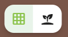



## Multi-select mode

When in multi-select mode (long press on any square or plant to enter multi-select mode), two icons appear:

When the plant icon is selected, that means when you tap to select, you'll be selecting plants.
This really only matters for large plants, such as tomatoes; when a tomato is selected it'll
highlight all 4 squares. If the grid was selected, you'd select just single squares, regardless
of the plants that are there. The grid icon is best for changing backgrounds whereas the plant
icon is best for adding notes or deleting plants. When you're in either selection mode, the add
plant icon disappears because it currently isn't possible to add plants to all selected squares.
